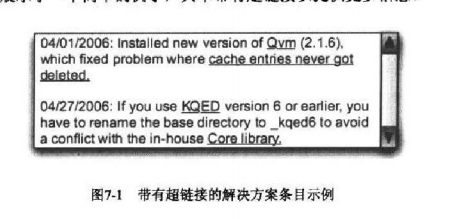

# 《高效程序员的45个习惯》读后感 🥦
### 了解平衡的艺术
在工作中，平衡是很重要的。在悉知自己工作角色定位下，在该定位下，平衡于各个角色中，实现自己的工作职责。在悉知工作职责的情况下，平衡调度各个细小任务。在悉知任务的实现难度下，平衡实现的工时和精力。
### 对工作比较实用的建议
其实全本从开发初期到交付到运维都写到了，甚至还提及了不少为人处世的方面，但是，对我而言，可能比较实用的确实可以改善的点是下面的几个。
##### 1.问题日志
事实上，工作中就是会发生一些错误。这很正常，我偶尔回去谷歌，但是，当遇到之前一样的问题，我总觉得没必要再浪费那么多时间搜索。有意识的写问题日志并把他们分类也是高效敏捷开发的一部分。
问题日志的主要内容应该为1.发生的日期，2.问题简述，3.解决方法详细描述，4.引用网址和文章提供细节和5.代码片段和一些图片截图帮助回忆当时的细节。
这个和bug的追踪很像，但是如果没测试人员，或者没分类好问题就很难找到之前的bug修复方法，于是，对于一些个人觉得比较难的和业务无关且有代表性的问题可以收集起来。
eg.

##### 2.注释和代码精简
需要重新回头看自己代码的时候希望可以一遍读懂之前自己想要做什么，注释可以帮助注释那些为什么当时我要写这段代码。正常是不需要解释这段代码在做什么，这是代码可以自解释的（当然我觉得一些不是很常见的库的api调用等也可以解释是在做什么），注释要解释的是为什么这么写有什么作用。精简的意思是简单且易于理解。

##### 3.引入新的插件（技术模块）
最好的方式是做个简易demo，只是为了证明它行之有效，为了说明的时候也比较方便。我们可以这样与项目经理演示，并说明引入后需要花费的时间和精力。

##### 4.定时做事
1.定时和客户沟通确认我们共同的目标。目标是流动的，需求也是，定个2，3个周的时间结点定时演示我们新增的功能有利于我们接近客户最后的理想目标。一次沟通也是一次修正。2.定时和团队的成员代码集成，实现一个功能就能提交并集成。定时做事帮助我们短迭代，增量开发和展示。

##### 5.测试
对于隔离的组件和模块，可以单元测试。对于有耦合的组件和模块，可以mock一些数据测试。

##### 6.沟通技巧
“不对，你说的是错的”，“你没考虑到...”修改成“你考虑过XX的事情嘛”。学会不带情绪的沟通，减少和每个角色的冲突。当有什么不清楚的情况下，假定一个让你困惑的情况和理由，从而提出问题，帮助我们更好理解对方的需求。

