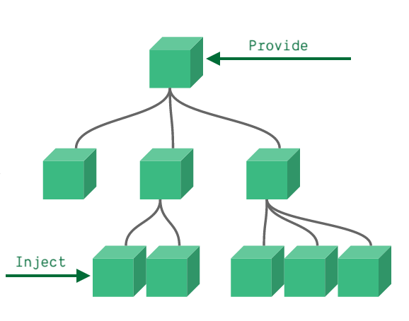

# 几种常见的组件传值方式
### 1. props/$emit
在父组件中的子组件上加:传递属性值="传入的值",子组件模块加入props属性，如下图：
``` vue
    //父组件视图
    <parent>
        <son :params="params"></son>
    </parent>
```
``` vue
    //子模块
    <script>
        props: {
            type: Number, //可能是String,Object,Array等
            default: 0  //可能的值，也是默认值
        },
    </script>
```
### 2. $refs/$parent/$children
可以通过$refs/$children获取子组件的属性和方法,$parent获取父组件的属性和方法。
eg.$refs
``` vue
    //父组件视图
    <parent>
        <son :ref="sonComponent"></son>
    </parent>
    //父组件方法
    methods: {
    todo: function () {
       //this.$refs.sonComponent.xx获取子组件的xx方法或属性
    }
    }
```

### 3. $attrs/$listeners
在子组件中可以通过$attr拿到父组件中的没被props的所有属性，可以通过$listener获取父组件中没被v-on事件监听的事件。

### 4. provide/inject
使用一对 provide 和 inject,无论组件层次结构有多深，父组件都可以作为其所有子组件的依赖提供者。这个特性有两个部分：父组件有一个 provide 选项来提供数据，子组件有一个 inject 选项来开始使用这些数据。([[vue官网]])


### 5. vuex
全局可以用vuex的state去存取公共属性,mutation存取公共方法。
```
const app = {
  state: {
    fullScreen: false //设置一个全局的属性
  },
  mutations: {
    SET_FULL_SCREEN: (state,fullScreen) =>{
      state.fullScreen = fullScreen //设置一个全局的方法
    },
  }}
```

## 6. bus
bus是个新的vue对象，但是主要用于传值。实现方式，可以在全局声明一个bus
```
//main.js中
var bus = {
    install(Vue,options) {
        Vue.prototype.$bus = vue
    }
};
Vue.use(bus)
```
发参数的组件
```
methods: {
  todo: function () {
    this.$bus.$emit('something', params);  //something是绑定的事件
    //...
  }
}
```
要收到消息的组件中可以用$emit/$on/$off监听事件
```
mounted() {
  this.$bus.$on('something', (params) => {  
      //todo something
  })
},
```
总结：用于父子组件的方式是以上6种,可以在多重组件中用的是3. $attrs/$listeners,4. provide/inject,5. vuex和6. bus。可以用于没有什么祖孙关系的组件传值的有5. vuex和6. bus。
https://v3.cn.vuejs.org/guide/component-provide-inject.html[vue官网]